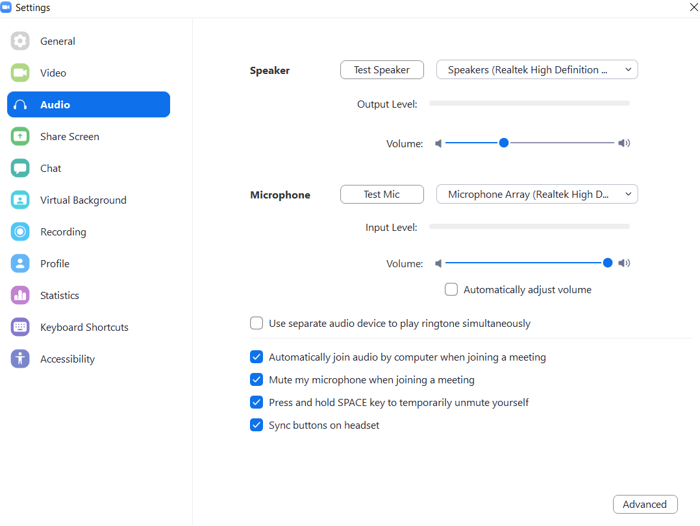
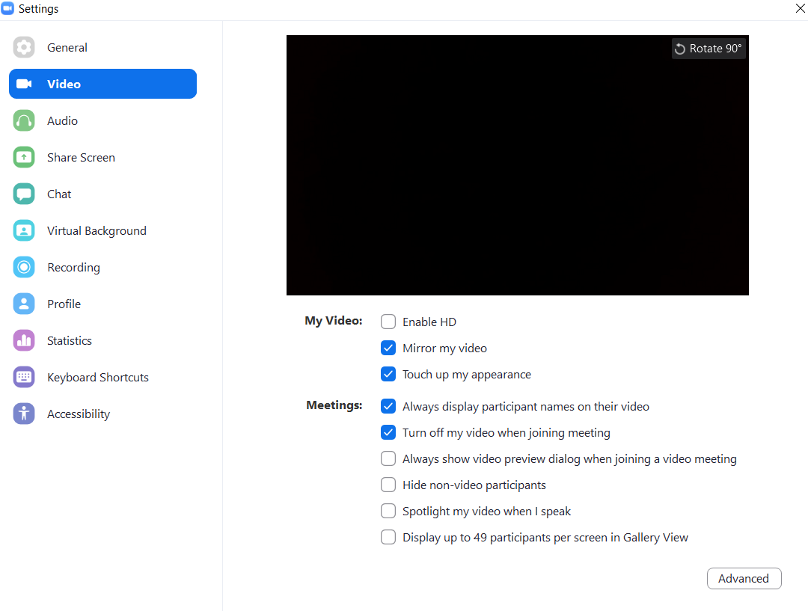

# 🐦Zoom Application Automation using Python🐦

[Hits](https://hits.seeyoufarm.com/api/count/incr/badge.svg?url=https://github.com/ngbala6/Automate_Zoom/&title=Views)

__Zoom Application Starts at Specified time with their meeting link and passcode__

### 🌞 Prerequisites

* For Windows, download from "zoom website" and install, I am using Zoom v5.8.0

* Install Zoom in Ubuntu 18.04

```
sudo apt-get install libxcb-xtest0
```

https://websiteforstudents.com/install-zoom-for-linux-client-on-ubuntu-16-04-17-10-18-04/

download deb file and do "sudo dpkg -i zoom.deb"

* Install Python Package
```
pip install pyautogui schedule
```

* Set Zoom Settings

##### Keep Audio Settings like this:


##### Keep Video Settings like this:


### 🌞 Configuration

Edit the Config file such as ___Start_Time, MeetingLink, Passcode, Application_Installed_Location___

Each Script inside the folder is designed for different Scenarios(without Login, With Login in Zoom) . . . Please read the respective Readme and use that best suits

This app is designed at Every day at your specified time. 

### 🌞 License & Copyright
Copyright © 2021 by **Bala Murugan N G**

Licensed under [Apache License 2.0](https://github.com/ngbala6/Automate_Zoom/blob/master/LICENSE) 

